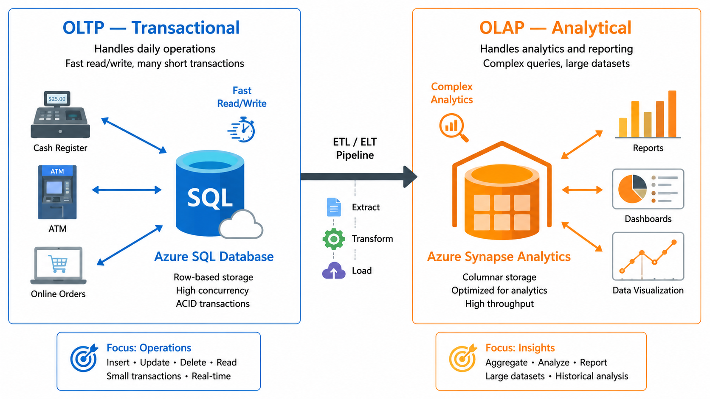

# Experiment No. 2
> Compare Transactional vs Analytical Workloads Using Sample Scenarios

## Aim / Objective:
To study the characteristics of OLTP (transactional) and OLAP (analytical) workloads and classify real-world scenarios into the correct workload type with justification.

## Requirements / Tools Used:
A computer with a word processor or spreadsheet, a web browser for Microsoft Learn documentation, and a printed list of business scenarios provided by the instructor.

## Theory / Background:
**Transactional (OLTP)** workloads handle large numbers of small, fast read/write operations — for example, placing an order or transferring money. They demand ACID properties (Atomicity, Consistency, Isolation, Durability), low latency, and normalized schemas.

**Analytical (OLAP)** workloads process large volumes of historical data to answer business questions — for example, "What were monthly sales by region last year?" They favour read-heavy aggregate queries, denormalized or star schemas, and data warehouses.

In Azure, OLTP maps to services like Azure SQL Database, while OLAP maps to Azure Synapse Analytics. Modern architectures often move data from OLTP systems into OLAP stores via ETL/ELT pipelines.

## Procedure / Steps:
1.  Revise the definitions and properties of OLTP and OLAP workloads from Microsoft Learn (DP-900 learning path).
2.  Prepare a comparison table with parameters: purpose, typical operations, data volume per operation, schema style, latency requirement, users, and example Azure service.
3.  Take at least eight scenarios (see the worksheet below).
4.  Classify each scenario as OLTP or OLAP and write a one-line justification.
5.  Identify which Azure service you would use for each scenario.
6.  Document the comparison table and classifications in the record.

## Sample Code / Data Used:

### OLTP vs OLAP — Reference Comparison

| Parameter              | OLTP                          | OLAP                              |
|-------------------------|-------------------------------|------------------------------------|
| Purpose                 | Run the business             | Analyze the business              |
| Typical Operations      | INSERT / UPDATE / DELETE     | SELECT with aggregates            |
| Data Volume per Query   | Few rows                     | Thousands to millions of rows     |
| Schema Style            | Normalized                   | Star / denormalized               |
| Latency Requirement     | Milliseconds (real-time)     | Seconds to minutes (batch/query)  |
| Typical Users           | Front-line staff, applications | Analysts, data scientists, executives |
| Example Azure Service   | Azure SQL Database            | Azure Synapse Analytics           |

### Scenario Classification Worksheet (to be completed)

| # | Scenario      | Workload Type (OLTP/OLAP)  | Suggested Azure Service |
|---|------------|:--------------------|------------------|
| a | ATM cash withdrawal                    |                                            |                           |
| b | Quarterly sales trend dashboard        |                                            |                           |
| c | Online ticket booking                  |                                            |                           |
| d | Churn analysis over 5 years of data    |                                            |                           |
| e | Adding an item to a shopping cart      |                                            |                           |
| f | Fraud pattern mining                   |                                            |                           |
| g | Hotel check-in system                  |                                            |                           |
| h | Demand forecasting                     |                                            |                           |

## Expected Output / Observations:
## Result / Conclusion:
## Learning Outcomes:
## Precautions / Cost Notes:
